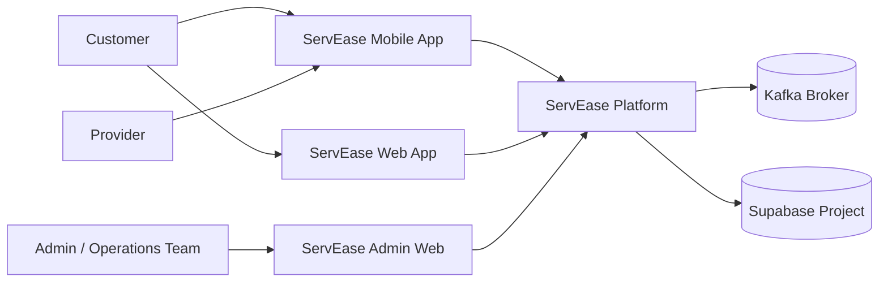
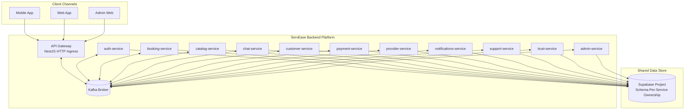
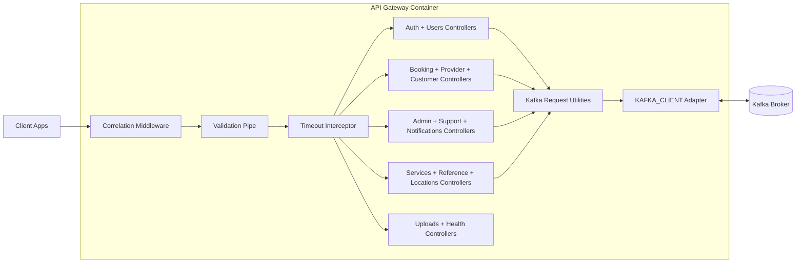
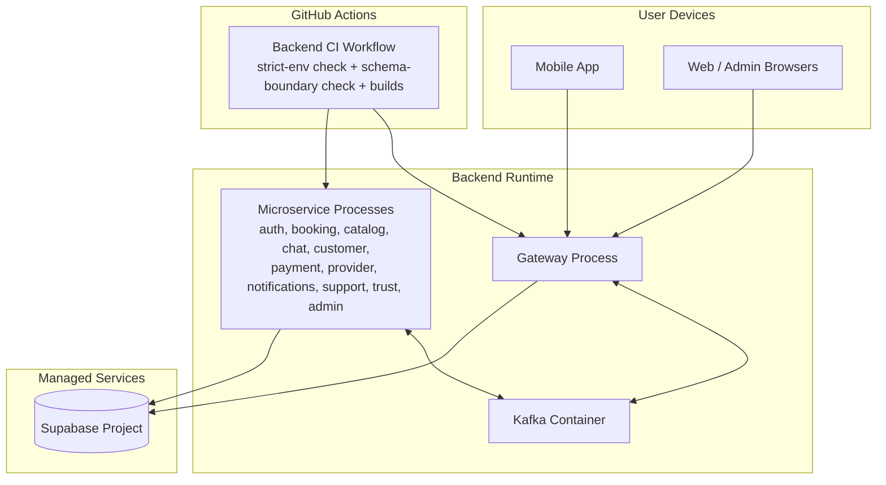

# ServEase C4 Architecture

This document provides a C4-style view of the current ServEase architecture.

## Scope and Assumptions

- Backend is microservices-oriented with Kafka request/reply contracts.
- Data is a single Supabase project with schema ownership boundaries per service.
- Gateway is the single HTTP entrypoint.

## Level 1 - System Context

## Level 2 - Container View

## Service-to-Schema Ownership

- auth-service -> identity_and_user
- booking-service -> booking
- catalog-service -> provider_catalog
- chat-service -> messages
- customer-service -> identity_and_user, identity_svc
- notifications-service -> notification_and_support
- payment-service -> payment
- provider-service -> provider_catalog
- support-service -> notification_and_support
- trust-service -> trust_and_reputation, trust_svc
- admin-service -> orchestrates across contracts; schema use guarded by checks

## Level 3 - Component View (Gateway Container)

## Level 4 - Deployment View (Current)

## Notes

- This is a full microservices architecture in service boundary and communication model.
- The remaining textbook caveat is shared physical storage (one Supabase project) instead of physically separate databases per service.
